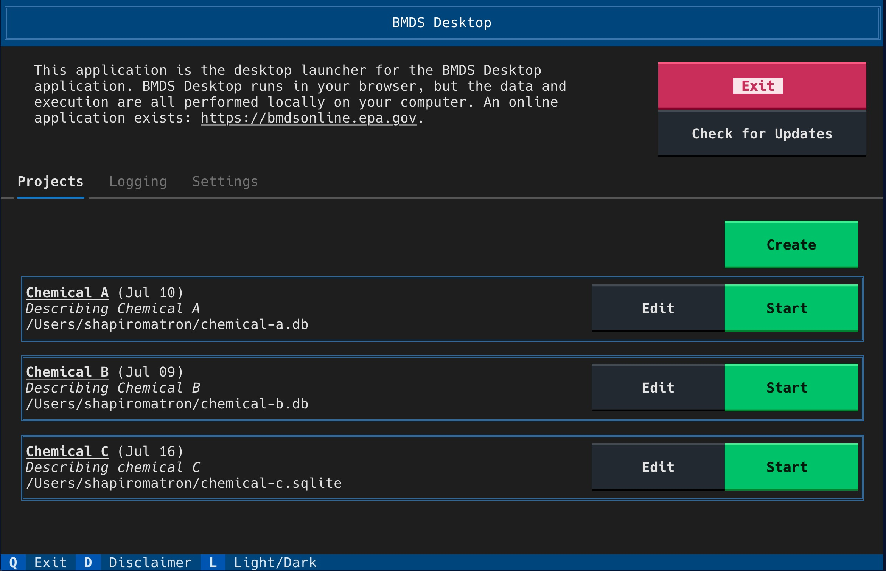

# BMDS UI

BMDS UI is a user interface for running [pybmds](https://pypi.org/project/pybmds/), a python package for dose-response modeling using the US EPA's Benchmark Dose Modeling Software ([BMDS](https://www.epa.gov/bmds)).  The user interface is a web application, but has two different deployment options:

* It can deployed as a web application, such as [BMDS Online](https://bmdsonline.epa.gov)
* It can be deployed locally as a desktop application, which we call **BMDS Desktop**.

**BMDS Desktop application home screen:**


**An example of the the user interface for model results:**


## BMDS Online vs. BMDS Desktop

BMDS Desktop is designed to run locally on your desktop computer in fully offline mode; it does not interact with any resources on the internet after initial installation. BMDS Online can be deployed online publicly or internally at a company or organization. Key differences between the software are described below:

**Item**|**Desktop**|**Online**
:-----:|:-----:|:-----:
Permission|BMDS Desktop runs on your computer in fully offline mode.|No login is required for the online application. An administrative account can be used to view the admin page
Analysis Visibility|The Desktop home page all analyses in a database|You must have the URL to an analysis in order to view
Analysis Deletion|Analyses have no deletion date|Analyses are automatically deleted on N days from current date, where N is a configurable parameter
Analysis organization|Analyses can be starred and labelled, and you can search on stars and labels|Analyses have no filtering available
Database technology|Uses a sqlite database file (single file)|Uses a PostgreSQL database (better for concurrency)

### BMDS Desktop Startup Screen

The BMDS Desktop has a startup screen where you can select which database file you'd like to use in your application. You can have multiple databases on your computer, one per project for example:


## Build Notes

To build containers for deployment:

```bash
make build
docker compose -f compose/build.yml --project-directory . build
```
